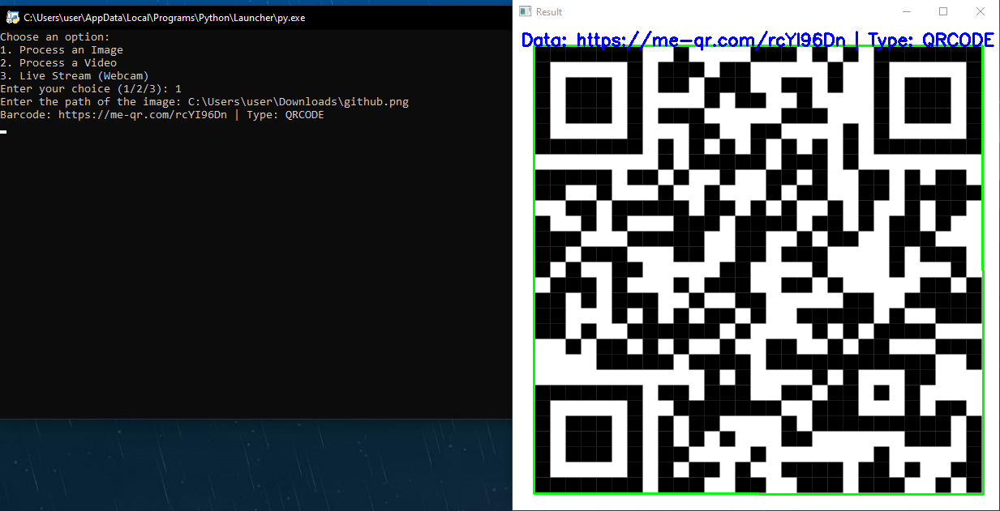
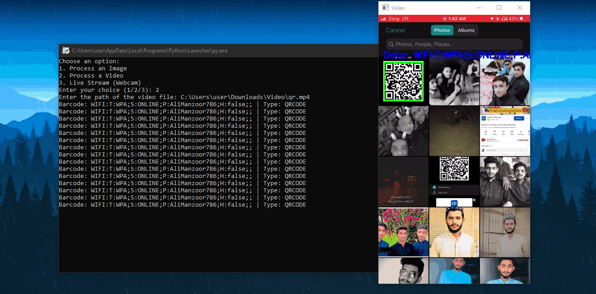
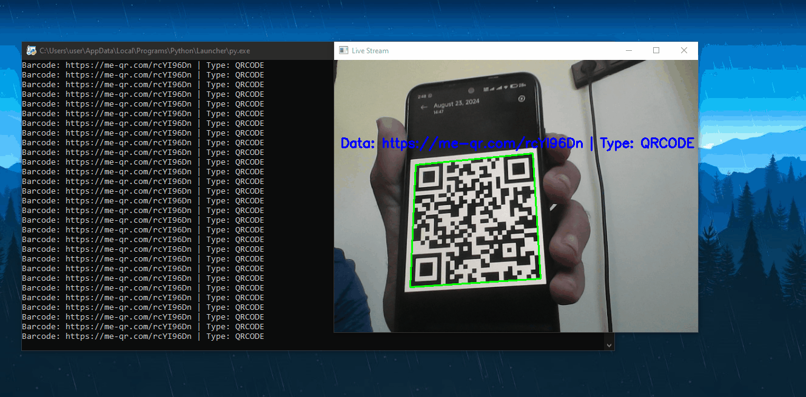

# Barcode and QR Code Detection

## Overview

This project is a Python-based application that allows users to detect and decode barcodes and QR codes from images, videos, or live webcam streams. The application uses OpenCV for image processing and `pyzbar` for barcode decoding, providing a versatile tool for recognizing various types of codes in different formats.

## Features

- **Image Processing:** Upload an image file containing a barcode or QR code, and the application will detect and decode the code, displaying the result directly on the image.
- **Video Processing:** Load a video file, and the application will process each frame to detect and decode barcodes and QR codes, showing the results in real time.
- **Live Stream (Webcam) Processing:** Use your webcam to scan barcodes or QR codes live, with real-time detection and decoding.

## Tools and Libraries Used

- **Python:** The programming language used to develop the project.
- **OpenCV:** A powerful library for real-time computer vision tasks, used here for capturing images and video, and for basic image processing.
- **pyzbar:** A Python library used for decoding barcodes and QR codes from images.
- **tkinter (optional):** Used to create a file dialog for selecting images or video files.

## Functionalities

1. **Process an Image:**
   - Allows the user to select an image file.
   - The image is processed to detect any barcodes or QR codes.
   - The detected code is highlighted, and the decoded data is displayed as a label on the image.

2. **Process a Video:**
   - Allows the user to select a video file.
   - The video is processed frame by frame to detect and decode barcodes and QR codes.
   - Detected codes are highlighted and labeled in real time as the video plays.

3. **Live Stream (Webcam):**
   - Uses the webcam to capture a live video feed.
   - Real-time detection and decoding of barcodes and QR codes in the live stream.
   - The detected code is highlighted, and the decoded data is displayed as a label on the live video feed.

## How to Use

1. **Clone the Repository:**
   ```bash
   git clone https://github.com/C-EB/Barcode_and_QR_Code_Detection.git
   cd Barcode_and_QR_Code_Detection
   ```

2. **Install the Required Libraries:**
   ```bash
   pip install opencv-python pyzbar
   ```

3. **Run the Script:**
   ```bash
   python Bar_QR_code_scanner.py
   ```

4. **Choose Your Option:**
   - **1:** To process an image.
   - **2:** To process a video.
   - **3:** To use the live webcam stream.

5. **Follow On-Screen Instructions:**
   - For image or video processing, you'll be prompted to enter the file path.
   - For live stream, the webcam will activate automatically.

## Example Outputs

### Image Processing Example



```python
# Example code snippet for image processing
file_path = "path_to_your_image.png"
image = cv2.imread(file_path)
result_image = decoder(image)
cv2.imshow('Result', result_image)
cv2.waitKey(0)
cv2.destroyAllWindows()
```

### Video Processing Example



```python
# Example code snippet for video processing
file_path = "path_to_your_video.mp4"
cap = cv2.VideoCapture(file_path)
while True:
    ret, frame = cap.read()
    if not ret:
        break
    frame = decoder(frame)
    cv2.imshow('Video', frame)
    if cv2.waitKey(1) & 0xFF == ord('q'):
        break
cap.release()
cv2.destroyAllWindows()
```

### Live Stream (Webcam) Example



```python
# Example code snippet for live stream processing
cap = cv2.VideoCapture(0)
while True:
    ret, frame = cap.read()
    if not ret:
        break
    frame = decoder(frame)
    cv2.imshow('Live Stream', frame)
    if cv2.waitKey(10) & 0xFF == ord('q'):
        break
cap.release()
cv2.destroyAllWindows()
```
